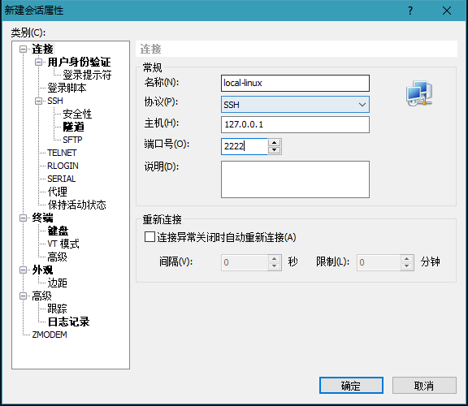
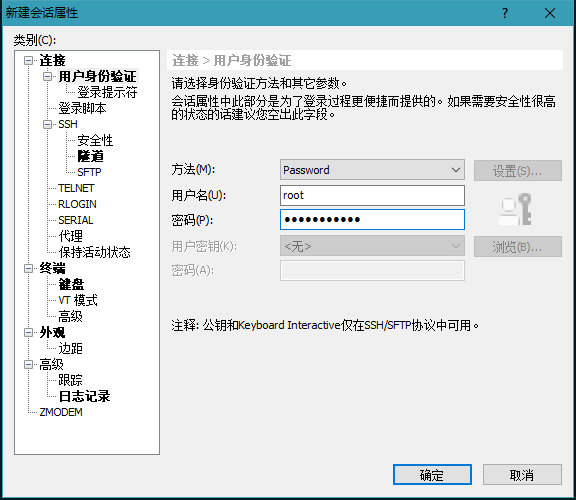
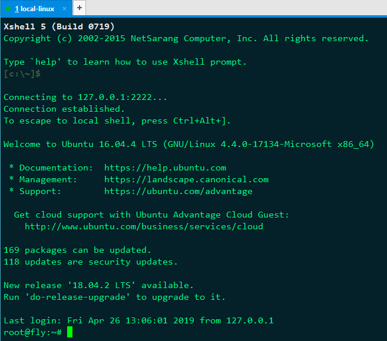
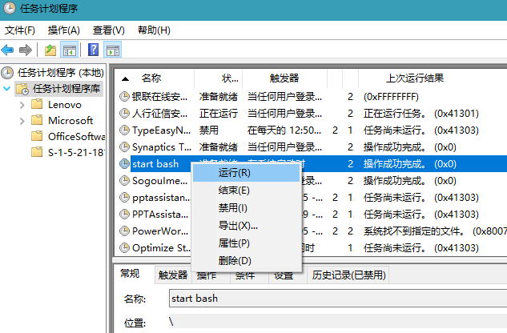

### 1 配置 SSH Server
```
# 卸载自带的 ssh
sudo apt-get remove openssh-server

# 安装 ssh
sudo apt-get install openssh-server

# 编辑配置文件
vim /etc/ssh/sshd_config

Port 2222 # 修改端口号，避免和 Windows ssh 服务端口冲突
UsePrivilegeSeparation yes # 使用密码登录
PermitRootLogin yes # 允许使用 root 用户登录


# 重启 ssh 服务
sudo service ssh --full-restart
```

### 2 使用 xshell 登录
#### 连接配置


#### 设置用户名和密码




### 3 Windows 配置开机自启动
#### 3.1 windows 计划任务配置
可以使用windows自带的定时任务计划上添加开机启动Ubuntu ssh服务的任务。
搜索“任务计划程序”，操作-- 创建基本任务：
- 触发器：当计算机启动时
- 操作：启动程序
- 程序名：bash.exe（默认打开的文件夹搜索即可）
- 参数为：```-c "sudo -u root /usr/sbin/sshd"```，开启 linux 子系统的 ssh 服务
- 选择“点击完成打开属性页”按钮，点击完成，打开属性页
- 在属性页选择“使用最高权限运行”

#### 3.2 测试计划任务命令
管理员身份打开 DOS 窗口
```
cd C:\WINDOWS\system32 # 进入到 bash.exe 所在路径
bash.exe -c "sudo -u root /usr/sbin/sshd" # 输入以下命令，回车

//  弹出如下提示
[sudo] password for user1: 
```
如果上述测试过程出现**输入密码的弹窗**，就需要为 user1 用户进行后续配置。

#### 3.3 linux 权限配置
配置完计划任务，执行时会因为 sudo root 要求输入密码，但因为任务自启动，不能填充密码。因此，我们可以针对启动用户设置使用 sudo 时无需密码。

只需修改 /etc/sudoers 文件即可。
```
vim /etc/sudoers
\# 添加以下
user1 ALL=(ALL) NOPASSWD: ALL # user1 用户执行 sudo 时无需密码
```

再使用 3.2 的步骤测试，发现已经没有输入密码的提示了。

### 4 计划任务测试
配置完成后，我们可以先关闭 linux 的 ssh 服务
```
sudo service ssh stop # 关闭 ssh 服务
ps aux | grep ssh # 查看 ssh 服务是否已关闭。只有 --color=auto 这一行。如果有其它行，使用 kill 命令关闭
```

回到任务计划程序页面，找到建立的计划任务。右键点击，手动运行，查看运行结果。

